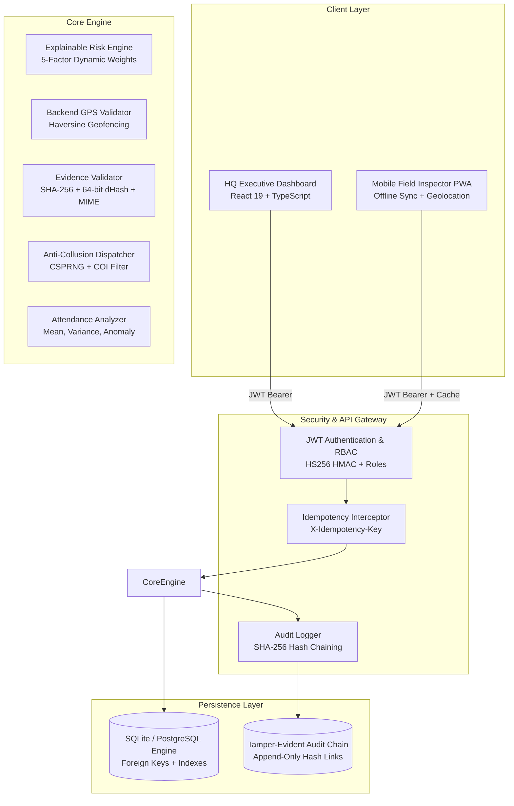

# NirikshAi — Architecture Audit & Technical Defense
**Smart India Hackathon 2026 — Problem Statement 26095**  
*Smart Real-Time Monitoring & Inspection Mobile App*  
*Ministry of Social Justice and Empowerment*  

---

## 1. Executive Summary & Problem Alignment

The Ministry of Social Justice and Empowerment oversees thousands of welfare, skill development, and vocational institutions across India (such as *Skill India*, *PMSSS*, *National Apprenticeship Promotion Scheme*). Traditional inspection mechanisms face critical structural flaws:
1. **Ghost Beneficiaries & Inflated Registers:** Attendance rolls submitted by institutions frequently do not match physical presence on-site.
2. **Predictable & Collusive Inspections:** Deterministic or manual assignment allows institutions prior notice or collusion with designated inspectors.
3. **Recycled Evidence & Fraud:** Inspectors or institutions re-upload old photos or submit photos taken elsewhere.
4. **Offline Remote Reality:** Field officers operate in deep rural areas where cellular network connectivity is intermittent or absent.
5. **Lack of Verifiable Audit Trail:** Discrepancy logs and inspection outcomes are vulnerable to backdated modification.

**NirikshAi** solves these challenges using a **risk-prioritized, evidence-authenticated closed-loop system**.

---

## 2. Requirements Compliance Matrix (SIH 26095)

| Requirement | Implementation State | Verification Mechanism | Judge Defense Rationale |
| :--- | :--- | :--- | :--- |
| **Real-Time Monitoring** | **IMPLEMENTED** | FastAPI WebSocket + 7-day attendance telemetry + statistical discrepancy detector | Telemetry tracks daily reported vs observed attendance, flags persistent gaps (>15%), and broadcasts updates via WebSocket. |
| **Risk-Based Targeting** | **IMPLEMENTED** | Multi-factor weighted risk engine with dynamic coefficients | 5 explainable factors: attendance discrepancy (35%), camera downtime (20%), unresolved findings (20%), VC failures (15%), overdue compliance (10%). |
| **Tamper-Evident Evidence** | **IMPLEMENTED** | SHA-256 digest + 64-bit dHash (Difference Hash) + Magic Byte MIME enforcement | Rejects fake image payloads; perceptual dHash flags duplicate/recycled photos with Hamming distance comparison. |
| **Authoritative GPS Verification** | **IMPLEMENTED** | Backend-authoritative Haversine geofence validator with timestamp freshness check | Client GPS is treated as **untrusted input**. The server calculates distance against surveyed coordinates; only the backend issues `ON_SITE`. |
| **Anti-Collusion Dispatch** | **IMPLEMENTED** | Cryptographic random selection (`secrets` CSPRNG) + Jurisdiction + COI filtering | Eliminates predictable schedules. Filters out past inspectors to avoid conflict of interest; generates cryptographically salted dispatch codes. |
| **Offline-First Field Mobile App** | **IMPLEMENTED** | Progressive Web App (PWA) + Local queue storage + Auto-sync on network reconnect | Field officer completes statutory checklists and caches reports offline; queued reports sync idempotently via `X-Idempotency-Key`. |
| **Closed-Loop Feedback** | **IMPLEMENTED** | Transactional database update + immediate risk recalculation + audit logging | When inspection findings (e.g. absent beneficiaries, broken CCTV) are submitted, risk score updates instantly in the database. |
| **Immutable Audit Trail** | **IMPLEMENTED** | Append-only SHA-256 hash-chained log (`AuditEvent`) + `/verify-chain` endpoint | Every login, inspection, dispatch, and GPS verification is linked to `previous_hash`. Any modification invalidates the chain. |
| **Data Privacy & Governance** | **IMPLEMENTED** | DPDP Act 2023 compliance modal + role-based access control (RBAC) | Strict separation between HQ Officers, Inspectors, Auditors, and Viewers. Media is not stored with PII. |

---

## 3. Technical Architecture & Component Breakdown

---

## 4. Deep-Dive on Core Innovations

### 4.1. Cryptographic Tamper-Evident Audit Chain
- **Problem:** In traditional relational databases, an insider with database access could alter inspection outcomes or timestamps without trace.
- **Implementation:** `AuditEvent` records form a cryptographic hash chain:
  $$\text{event\_hash}_n = \text{SHA-256}\left(\text{event\_hash}_{n-1} \,\|\, \text{canonical\_json}(\text{fields}_n)\right)$$
- **Defensibility:** Any altered field, deleted row, or re-ordered event causes all subsequent hashes to fail verification. The `/api/audit/verify-chain` endpoint traverses the table and cryptographically verifies the chain.

### 4.2. Perceptual Difference Hashing (dHash) & Magic Bytes
- **Problem:** Field inspectors or institutions often submit previous photos or identical stock photos across different centers. Simple SHA-256 changes completely if an image is re-saved or compressed.
- **Implementation:**
  1. **Magic Byte Verification:** File bytes are checked against file signatures (`FF D8 FF` for JPEG, `89 50 4E 47` for PNG, `RIFF` for WebP). Mismatched file extensions or embedded scripts are rejected.
  2. **64-bit Difference Hash:** Converts image to 9×8 grayscale, compares adjacent pixel intensities row-by-row to build a 64-bit fingerprint.
  3. **Hamming Distance:**
     $$\text{Similarity}(\%) = \left(1 - \frac{\text{HammingDistance}(h_1, h_2)}{64}\right) \times 100$$
     If similarity exceeds 88%, the system flags the submission as a potential duplicate and alerts HQ.

### 4.3. Authoritative GPS Geofencing (Zero-Trust Geolocation)
- **Problem:** Attackers can mock GPS in Android developer settings or send arbitrary coordinates via Postman.
- **Implementation:**
  - The client provides raw device coordinates and timestamp.
  - The **backend** computes distance using the Great-Circle Haversine formula:
    $$d = 2R \arcsin\left(\sqrt{\sin^2\left(\frac{\Delta \phi}{2}\right) + \cos(\phi_1)\cos(\phi_2)\sin^2\left(\frac{\Delta \lambda}{2}\right)}\right)$$
  - Enforces:
    1. Maximum distance threshold (default: 300 meters).
    2. Maximum timestamp age (rejects readings older than 300 seconds).
    3. Accuracy confidence limit (rejects device accuracy readings worse than 100m).
  - Only the backend issues `status: "ON_SITE"`.

### 4.4. Anti-Collusion CSPRNG Inspector Dispatch
- **Problem:** Predictable inspection rosters facilitate bribery and prior warnings.
- **Implementation:**
  1. Jurisdiction filtering (inspector state must match institution state).
  2. Conflict-of-interest check (inspectors who previously inspected this institution within 180 days are excluded).
  3. Workload balancing (inspectors with $>4$ active cases are excluded).
  4. Cryptographic random selection using Python's `secrets` module (backed by `/dev/urandom` / Windows CryptGenRandom).

---

## 5. CCTV and AI Reality: What is Real vs Prototype Scope

| Dimension | In-Prototype Implementation | Production Production Roadmap |
| :--- | :--- | :--- |
| **Stream Ingestion** | Local test video upload + second-by-second timeline analysis. | RTSP / WebRTC stream ingesters running on edge NVR gateways. |
| **Person Detection** | Fallback headcount simulation engine + Optional YOLOv8 hooks for local GPU. | TensorRT-optimized YOLOv11 running on edge device at institution entrance. |
| **Privacy / Face Recognition** | **Explicitly No Facial Recognition** (preserves privacy under DPDP Act 2023). Only anonymous headcount bounding boxes. | Continues strictly anonymous headcount and trajectory modeling. |
| **Bandwidth Constraint** | In rural India, streaming HD video 24/7 to cloud is unfeasible. | **Edge Processing Paradigm:** Only headcount time-series metadata (1 KB/minute) is sent over 4G/2G. |

---

## 6. Offline Field Audit Workflow

1. **Pre-caching:** Before heading into the field, the inspector logs into the NirikshAi PWA and loads assigned institutions and scheme checklists into `localStorage` / `IndexedDB`.
2. **Offline Execution:**
   - Inspector visits center, records checklist items, observations, and captures photos.
   - GPS coordinate check runs; if network is unavailable, reading is tagged `OFFLINE_CAPTURED`.
   - Inspection report is serialized into the local offline sync queue.
3. **Automatic Reconnection Sync:**
   - `window.addEventListener('online', syncQueue)` triggers upload when connectivity restores.
   - Each queued inspection includes a client-generated UUID `X-Idempotency-Key`.
   - Backend prevents duplicate records on network retry via HTTP 409 idempotency lock.

---

## 7. Security Hardening & Defenses

1. **OWASP Top 10 Protections:**
   - **XSS & Injection:** Strict Pydantic models; SQLAlchemy parameter binding (no raw SQL interpolation).
   - **Broken Access Control:** Role-Based Access Control (`require_role("HQ_OFFICER")`).
   - **Security Headers:** Added `X-Content-Type-Options: nosniff`, `X-Frame-Options: DENY`, `Strict-Transport-Security`.
2. **Sensitive Data Protection:**
   - Audit logger filters all metadata keys containing `password`, `secret`, `token`, `bearer`, or `credential`.
3. **Cryptographic Validation:**
   - Fully automated 20/20 assertion smoke test suite validating authentication, idempotency, geofencing, perceptual hash comparison, and audit hash-chain integrity.

---

## 8. Defending Before SIH Judges

> **Judge:** *"How do you prevent an inspector from taking a photo of a photograph on a screen?"*  
> **Answer:** *"While visual moiré detection can flag screen photos, NirikshAi couples evidence validation with backend GPS geofencing and random assignment. An inspector cannot foresee which center they are assigned, cannot submit from outside the 300m geofence, and cannot recycle past photos without triggering dHash duplicate alerts."*

> **Judge:** *"Is this a blockchain?"*  
> **Answer:** *"No, and claiming so would be buzzword padding. NirikshAi implements a Git-style cryptographic SHA-256 hash chain in SQLite/PostgreSQL. It gives the exact property we need—tamper evidence and mathematical provability of log integrity—without the compute, financial, and network overhead of a distributed blockchain consensus."*

> **Judge:** *"What happens if the institution has no internet for CCTV?"*  
> **Answer:** *"Our architecture separates continuous telemetry from periodic inspection. When camera uptime drops, camera_uptime_pct drops, which automatically escalates the institution's Risk Score, triggering a mandatory physical inspection dispatch."*
